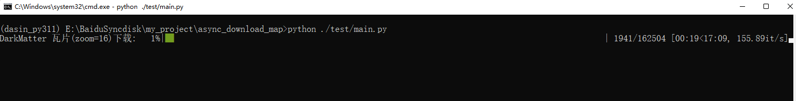

# Async Download Map Tiles

使用python的协程技术，实现高并发的地图瓦片爬取

## 简介

此项目旨在实现高并发的地图瓦片爬取，尤其是针对本地化部署的OpenStreetMap服务，部署操作可参考[如何实现OSM地图本地发布并自定义配图](https://blog.csdn.net/gisarmory/article/details/110931322)。

## 功能

- 高并发爬取地图瓦片
- 进度条检测运行进度
- 瓦片地图自动打包至压缩包

命令行运行实例：

Linux 后台挂起运行

## 安装

### 安装依赖

```bash
pip install -r requirements.txt
```

### 安装包（可选，命令行调用需先安装包）

```bash
# 安装依赖
pip install .
```

## 使用

### 快速使用

#### Windows

```bash
# 安装依赖
pip install .
# 运行脚本
python ./test/main.py
```

#### Linux

```bash
# 安装依赖
pip install .
# 后台挂起运行脚本
nohup python main.py > /dev/null 2>&1 &
```

## 常规调用

## 常规调用

**函数签名**

```python
MapTilesDownloader(
    base_url: str,
    top_left_coord: Tuple[float, float],
    bottom_right_coord: Tuple[float, float],
    zoom_range: Tuple[int, int],
    save_file: str,
    log_file: str = None
) -> None
```

**参数说明**

- base_url (str): 瓦片爬取基础的 URL（不含最后的 '/'）。
- top_left_coord (Tuple[float, float]): 待爬取范围的左上角坐标，坐标系为epsg:3857(x, y)。
- bottom_right_coord (Tuple[float, float]): 待爬取范围的右下角坐标，坐标系为epsg:3857(x, y)。
- zoom_range (Tuple[int, int]): 缩放等级的下载范围。
- save_file (str): 保存瓦片的文件夹路径。
- log_file (str, 可选, 默认值: None): 文件日志名称。如果为 None，则不生成日志文件。

**返回值**: 无返回值

**灵活操作**

- 重写 MapTilesDownloader 的 calculate_tile_indices 方法：输入坐标 -> 瓦片坐标
- 重写 MapTilesDownloader 的 generate_tile_urls 方法：生成待爬取瓦片的 url 的列表

### 推荐调用

参考 ./test/main.py 的调用方式

## 许可

本项目基于 MIT 许可协议开源，请参阅 LICENSE 文件了解更多信息。

## 作者

Dasin dasin_huang@qq.com

## 致谢
